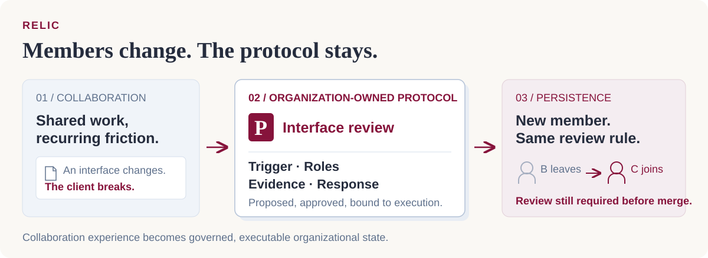
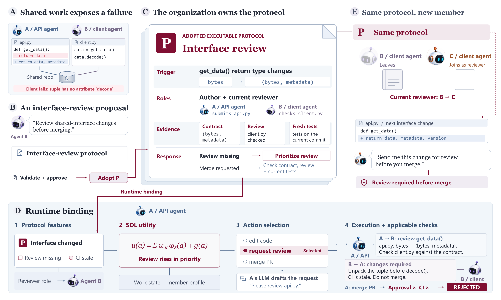

# Relic: From Multi-Agent Collaboration to Persistent Organizational Capability

[Paper](https://arxiv.org/abs/2609.32965) · [Project website](https://hongyidu.ai/relic/en) · [Watch a run](https://hongyidu.ai/relic/en/experience) · [Documentation](docs/README.md) · [中文](README.zh-CN.md)

**What does an AI team keep when its members change?** Relic turns recurring
collaboration failures into organization-owned, executable protocols. Members
propose and govern rules; adopted protocols bind triggers, responsibilities,
required evidence, and execution consequences to later work. The organization
can retain and revise them beyond the members who created them.



## See the mechanism

An interface changes, a client breaks, and the team adopts an interface-review
protocol. The rule changes what the runtime prioritizes and checks. When the
reviewer changes, the review requirement stays with the organization.

[](https://hongyidu.ai/relic/en)

Explore the [interactive figure](https://hongyidu.ai/relic/en) or read the
[protocol lifecycle](docs/protocol_lifecycle.md). For experimental evidence, see
the [paper](https://arxiv.org/abs/2609.32965) and the
[reported results snapshot](artifacts/paper_results/paper_results.md).

## Watch before installing

The [online Experience](https://hongyidu.ai/relic/en/experience) pairs an
animated organization replay with an Inspector: watch a protocol affect work,
then inspect the corresponding organization state.

A self-contained archive visualization is also included in this repository.
Serve it with Python, then open `http://localhost:8000/`:

```bash
git clone https://github.com/Hongyi-Du/Relic.git relic
cd relic
python3 -m http.server 8000 --directory demo
```

Choose **Story** for the guided protocol lifecycle, or scrub the full run.
This bundled cattrs replay is a single parity run, not the paper's aggregate.
See [demo/README.md](demo/README.md) for its data and controls.

## Choose your starting point

| You want to… | Start here |
| --- | --- |
| Understand the research | [Paper](https://arxiv.org/abs/2609.32965) · [Interactive website](https://hongyidu.ai/relic/en) |
| Reproduce the experiments | **This repository:** frozen benchmarks, B0–B3 configurations, OrgEnv, evaluators, and [reproduction entrypoints](reproduction/README.md) |
| Build your own agent organization | [**Relic-Agent**](https://github.com/Hongyi-Du/Relic-Agent): the configurable, benchmark-independent organization runtime and Inspector |

## Quickstart

Use **Python 3.12+**, **uv**, and **Linux or WSL2**. On Windows, clone into the
WSL Linux filesystem, for example `~/relic`. If you already cloned the
repository above, start with `uv sync`.

```bash
git clone https://github.com/Hongyi-Du/Relic.git relic
cd relic
uv sync --extra dev --frozen
cp .env.example .env
uv run relic verify-benchmark
uv run relic check-env --scope core
uv run relic smoke --mode mock
```

These checks do not contact a model provider. The mock smoke verifies wiring;
it is not an experimental result. Run `uv run pytest -q` for the release test
suite. [Installation](docs/installation.md) covers the full setup;
[environment.md](docs/environment.md) covers Docker, platform support, and
output directories.

## Run a paper experiment

The YAML files in [configs/](configs/) and the frozen
[relic-main-v1 benchmark](benchmarks/relic-main-v1/) specify the experiment:
10 workloads × 3 seeds × 4 arms = **120 cells per model**.

<details>
<summary><strong>How B0–B3 differ</strong></summary>

| Arm | Members | Decision mode | Profile/capability conditioning | Protocol lifecycle |
| --- | ---: | --- | --- | --- |
| B0 | 1 | Direct LLM action selection | Off | Off |
| B1 | 8 persistent roles | Direct LLM action selection | Off | Off |
| B2 | 8 persistent roles | SDL/profile policy | On | Off |
| B3 | 8 persistent roles | SDL/profile policy | On | On, including runtime protocol binding |

Canonical definitions: [configs/arms/](configs/arms/).
B2 and B3 share the structured team; B3 adds governed, executable protocols.

</details>

First create a plan without provider calls:

```bash
uv run relic run-main \
  --model gpt-5.6-terra \
  --output-root outputs/main-study \
  --manifest outputs/main-study/source_main_manifest.json \
  --max-parallel 1 \
  --dry-run
```

Configure your OpenAI-compatible provider in the local `.env`:

```dotenv
OPENAI_API_KEY=your-key
OPENAI_BASE_URL=https://your-gateway.example/v1
RELIC_RUNTIME_MODEL=your-provider-deployment
```

Then run one paired B0–B3 batch:

```bash
uv run --env-file .env relic run-main \
  --manifest outputs/main-study/source_main_manifest.json \
  --resume \
  --max-parallel 1 \
  --workload w01 \
  --seed 1401
```

Remove `--workload` and `--seed` for the complete model-specific study.
Each batch writes checkpoints, evaluator metadata, and
`experiment_runs.json/jsonl`; the top-level manifest links its results.
These are your local runs, distinct from the checked-in paper-results snapshot.

Direct `uv run relic ...` commands do not load `.env` implicitly. Use
`uv run --env-file .env relic ...` for provider-backed commands.
`--model` preserves the canonical paper model ID; `--runtime-model` or
`RELIC_RUNTIME_MODEL` selects your provider's deployment name.

<details>
<summary>Provider aliases and resume behavior</summary>

Credentials remain in the local `.env`; they are not written to public traces,
plans, or manifests. The thin Bash wrappers in `scripts/bash/` load the
allow-listed environment values automatically.

Runtime-name precedence is `--runtime-model`, then `RELIC_RUNTIME_MODEL`,
`ORG_LLM_RUNTIME_MODEL`, `OPENAI_MODEL`, and `ORG_LLM_MODEL`.
For the Claude paper arm, `RELIC_CLAUDE_OPUS_4_6_MODEL` supplies the gateway
alias when no generic override is present. An unresolved dry plan can receive
the name on its first execution. Resume keeps the recorded model identity
after execution starts. See [environment.md](docs/environment.md) for optional
headers and complete provider configuration.

</details>

## Continue with the research

| Topic | Guide |
| --- | --- |
| Main study and outputs | [Main-results reproduction](reproduction/main_results/README.md) · [Configuration](docs/configuration.md) |
| Fresh-member transfer | [Transfer](docs/transfer.md) · [Transfer reproduction](reproduction/transfer/README.md) |
| Public traces and Inspector | [Inspector](docs/inspector.md) |
| Evaluator provenance and containers | [Evaluator](docs/evaluator.md) · [Environment](docs/environment.md) |
| Human-seat extension | [`hci` branch](https://github.com/Hongyi-Du/Relic/tree/hci) |
| CooperBench extension | [`cooper` branch](https://github.com/Hongyi-Du/Relic/tree/cooper) |
| Release scope and available artifacts | [Release scope](docs/release-scope.md) · [Scope and validation limits](docs/KNOWN_RELEASE_GAPS.md) |

The main and transfer paths use the public host evaluator by default. Optional
`--evaluator-bindings` records container provenance; `--strict-reproducibility`
requires digest-pinned `linux/amd64` images and qualification hashes.

<details>
<summary>Transfer commands</summary>

The transfer study adds fresh B2 Text and Exec targets. Fresh uses the matching
main-study B2 result.

```bash
uv run relic run-transfer --dry-run \
  --output-root outputs/transfer-v2 \
  --workload w01 \
  --seed 1401
uv run --env-file .env relic run-transfer \
  --manifest outputs/transfer-v2/transfer_manifest.json \
  --resume \
  --max-parallel 1 \
  --workload w01 \
  --seed 1401
```

</details>

<details>
<summary>Aggregating legacy cell-scheduler runs</summary>

The paired `run-main` path already writes each batch's experiment aggregate.
The separate legacy cell scheduler uses `run_manifest.json`; these commands
accept that format, not `source_main_manifest.json`:

```bash
uv run relic evaluate \
  --manifest outputs/user-run/run_manifest.json \
  --receipt-directory outputs/user-run/evaluation
uv run relic aggregate-user-runs \
  --evaluation-manifest outputs/user-run/evaluation/evaluation_manifest.json \
  --output-directory outputs/user-run/aggregate \
  --allow-partial
```

Failed or degraded cases remain labeled. Local aggregates do not recompute or
replace the paper's reported results snapshot.

</details>

## Citation

If you use the research, please cite the [paper](https://arxiv.org/abs/2609.32965):

```bibtex
@misc{du2026relic,
  title={Relic: From Multi-Agent Collaboration to Persistent Organizational Capability},
  author={Hongyi Du and Tianyi Zhang and Weijia Zhang and Yi Yang and Haofei Yu and Kunlun Zhu and Tianxiang Dai and Shang Jiang and Zhelun Gao and Jiaxin Pei and Shang Zhu and Jiaxuan You},
  year={2026},
  eprint={2609.32965},
  archivePrefix={arXiv},
  primaryClass={cs.AI},
  url={https://arxiv.org/abs/2609.32965}
}
```

## License

Relic's original source is source-available under the
[PolyForm Noncommercial License 1.0.0](LICENSE): noncommercial use,
modification, and distribution are permitted under its terms. Commercial use
requires a separate written license from Hongyi Du; see
[Commercial licensing](COMMERCIAL_LICENSE.md).

Third-party benchmark snapshots and other third-party components retain their
own licenses. The repository-level license does not replace those terms.
